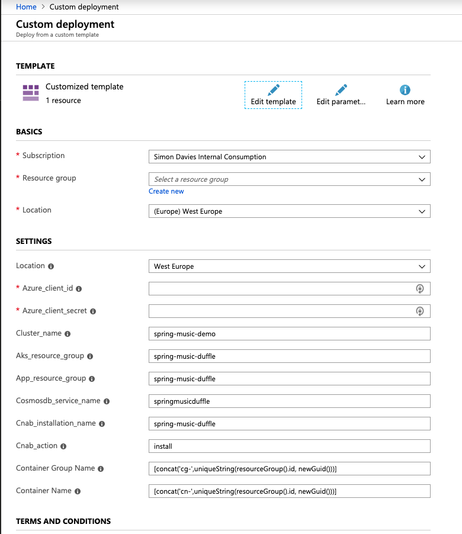

# Azure CNAB Quickstart Packages 

This repository contains a set of Azure focused CNAB Packages contributed by the community that can be used to deploy and manage applications using Azure. To learn more about CNAB go [here](https://cnab.io/) or watch [this](https://www.youtube.com/watch?v=r6aqKhvdsRs) video.

## Repository Structure

The repository contains the source for Azure focused CNAB bundles, each bundle is contained in a directory under one of the following directories:

* duffle - These bundles are defined and built using [Duffle](https://duffle.sh/ 'The duffle website')
* porter - These bundles are defined and built using [Porter](https://porter.sh/ 'The porter website')

The invocation image for each bundle is built as part of a CI\CD pipeline and is stored in an Azure Container Registry at (https://cnabquickstarts.azurecr.io) once the CNAB spec and tools support pushing and pulling bundles directly to\from  OCI registries then the entire bundle will be hosted in the registry, until that time the CI`CD process creates a bundle file and pushes this to the same registry using [ORAS](https://github.com/deislabs/oras).

## How to Install\Update a Package

Any CNAB compliant tool can be used to deploy these packages, to make it easy to install without having to download and install any software the following approaches can be used:

### Install using the Azure Portal

The easiest way to install a Package is to use the Deploy to Azure button from the README for each solution, this will launch the Azure Portal Template deployment experience:

Packages deployed through the portal run a [Docker Image](./client/duffle-aci-docker) using ACI that in turn runs duffle using the [duffle-aci-driver](https://github.com/deislabs/duffle-aci-driver), these ACI hosted containers are set to run once by using a restart policy o "never'. When the deployment is successfully completed in the portal this signifies that the container has been successfully started, in order to check the progress of the CNAB package deployment you need to access the logs from the container, the easiest way to do this is to navigate to the deployment outputs in the portal and copy the 'CNAB Package Action Logs Command', then open cloud shell and paste the command.

Once the deployment is complete you can follow whatever instructions the CNAB Package provides to access the application, for example the duffle\spring-music-cnab solution provides the following instructions:

### Install using Azure CloudShell

CNAB packages can also be deployed using Azure CloudShell, when using Azure CloudShell Duffle is required . For instructions on setting up CloudShell see [this document](set_up_cloudshell.md) 

## How to Build a Package

## Contributing

This project welcomes contributions and suggestions.  Most contributions require you to agree to a
Contributor License Agreement (CLA) declaring that you have the right to, and actually do, grant us
the rights to use your contribution. For details, visit https://cla.microsoft.com. All contributions made to and solutions provided in this repository are licensed under the MIT license which can be found [here](LICENSE).

When you submit a pull request, a CLA-bot will automatically determine whether you need to provide
a CLA and decorate the PR appropriately (e.g., label, comment). Simply follow the instructions
provided by the bot. You will only need to do this once across all repos using our CLA.

This project has adopted the [Microsoft Open Source Code of Conduct](https://opensource.microsoft.com/codeofconduct/).
For more information see the [Code of Conduct FAQ](https://opensource.microsoft.com/codeofconduct/faq/) or
contact [opencode@microsoft.com](mailto:opencode@microsoft.com) with any additional questions or comments.
https://duffle.sh/
